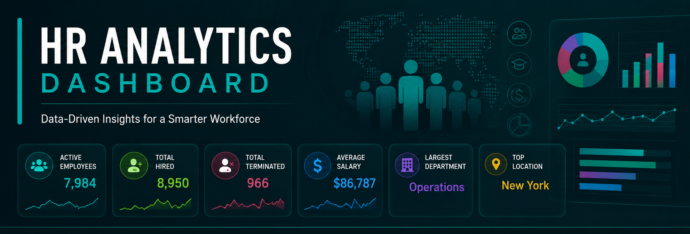
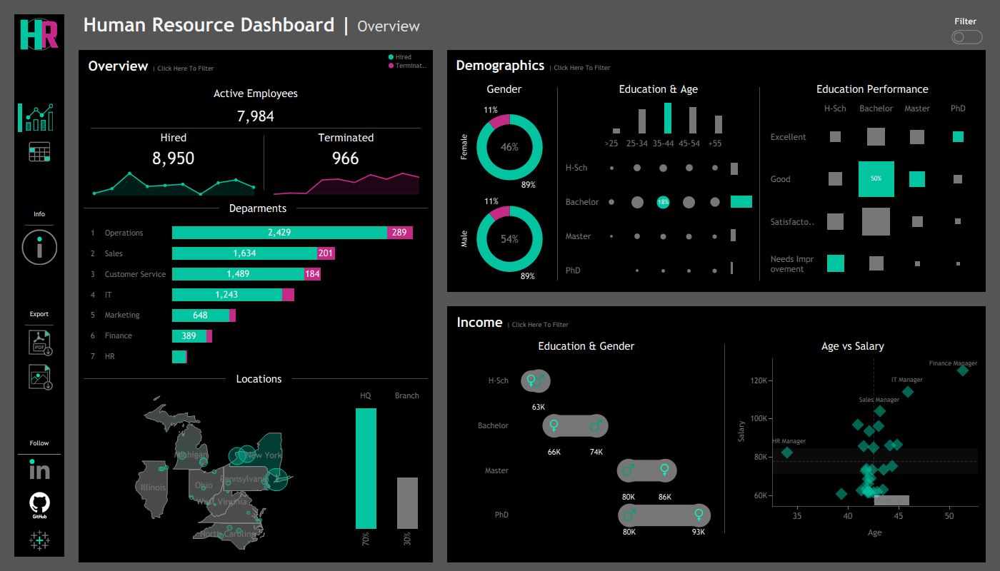
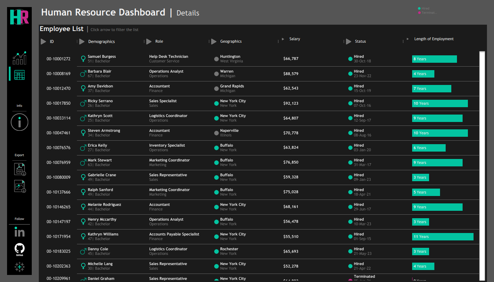

<div align="center">
  
<p align="center">
  
</p>

# 📊 HR Analytics Dashboard

### *Interactive HR Business Intelligence Dashboard built with Tableau*

Analyze workforce performance, hiring trends, employee demographics, salary distribution, and HR KPIs through an executive-level interactive dashboard.


</div>

---

# 📸 Dashboard Preview

### Executive Overview

<p align="center">

</p>

### Employee Details

<p align="center">

</p>

---

# 🎯 Project Overview

This dashboard provides an executive view of organizational workforce performance by combining employee demographics, hiring activity, salary analysis, and department-level insights into a single interactive reporting solution.

It is designed to support HR managers and business leaders in making data-driven workforce decisions.

---

# 📌 Business Questions

* Workforce size and employee status
* Hiring vs. termination trends
* Department-wise employee distribution
* Salary analysis across demographics
* Employee tenure analysis
* Geographic workforce distribution

---

# 📈 Executive KPIs

| KPI                |          Value |
| ------------------ | -------------: |
| Active Employees   |      **7,984** |
| Total Hired        |      **8,950** |
| Total Terminated   |        **966** |
| Highest Salary     |   **$149,377** |
| Largest Department | **Operations** |
| Primary Location   |   **New York** |

---

# ✨ Dashboard Features

* Executive HR Dashboard
* Employee Detail Report
* Interactive Filters
* Cross Filtering
* Department Analysis
* Salary Analysis
* Demographic Analysis
* Geographic Analysis

---

# 🛠 Tech Stack

| Tool                      | Purpose               |
| ------------------------- | --------------------- |
| Tableau Desktop           | Dashboard Development |
| Excel / CSV               | Data Source           |
| Tableau Calculated Fields | Business Logic        |
| Dashboard Actions         | Interactive Analysis  |

---

# 📂 Project Structure

```text
HR-Analytics-Dashboard/
│
├── Dashboard/
│   └── HR_Dashboard.twbx
│
├── Dataset/
│   └── Dataset.csv
|
├── Documentation/
│   └── HR Analytics Dashboard — BI Documentation.pdf
│
├── assets/
├──   ├── images/
│         ├── HR Summary_noFL.png
│         ├── HR Details_noFL.png
│         ├── HR Summary_FL.png
│         └── HR Details_FL.png
├──   ├── styles/
│         └── style.css
│
├── index.html
├── banner.png
├── README.md
└── LICENSE
```

---

# 📖 Documentation

Detailed project documentation is available in:

📄 **Documentation/HR Analytics Dashboard — BI Documentation.pdf**

This includes:

* Dataset Schema
* Dimensions & Measures
* Calculated Fields
* KPI Definitions
* Business Logic
* Dashboard Design Notes

---

# 💼 Business Value

This project demonstrates how Tableau can transform raw HR data into an executive reporting solution that supports workforce planning, employee monitoring, compensation analysis, and strategic HR decision-making.

---


## 👨‍💻 About Me

<div align="center">

[](https://github.com/jerin060)
[](https://linkedin.com/in/jarin-akther-analyst)


### ⭐ If you found this project useful, consider giving it a star!

Made with ❤️ using Tableau

</div>
